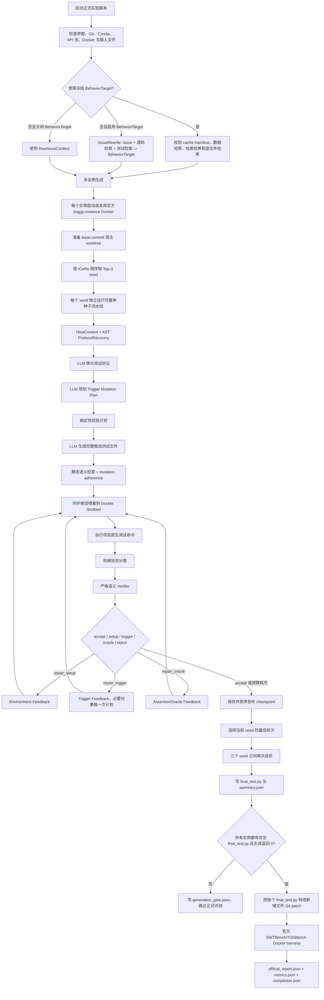

# BRT6 当前代码实现流程详解

本文档按当前工作区源码逐步说明 BRT6 的真实实现，重点回答以下问题：

- 系统从哪些文件读取什么数据；
- 每一步接收什么输入、执行什么处理、产生什么输出；
- 哪些步骤会调用大模型；
- 每次大模型调用的大致 Prompt、变量和返回格式是什么；
- 候选测试如何在 buggy 版本上执行、分类、修复和选优；
- 最终 `final_test.py` 如何进入官方 SWTBench/TDDBench 评测；
- 每个结果文件包含什么内容；
- 哪些模块虽然仍保留在仓库中，但当前正式主流程并没有调用。

文档以以下文件代表的正式实现为准：

- `scripts/run_official_swt_full.sh`
- `scripts/run_p0_simple_llm_selector_full.sh`
- `pipeline/run_issue_rewrite.py`
- `pipeline/run.py`
- `execution/feedback.py`
- `runtime/official_docker_runtime.py`
- `scripts/run_official_eval_after_generation.py`

本文描述的是代码结构和数据流，不代表某次正在运行的实验已经完成。

## 1. 系统最终要做什么

BRT6 的目标是：针对 benchmark 中的每一个 Issue，自动生成一个独立、完整、可收集的 Python 缺陷复现测试（Bug Reproduction Test，BRT）。

一个合格 BRT 的期望语义是：

```text
buggy/base-commit 版本：测试失败
应用真实修复补丁后的版本：测试通过
```

生成阶段只允许使用：

- 原始 Issue；
- iCoRe 检索到的相关源码片段；
- iCoRe 检索到的相关测试片段；
- buggy 仓库的 base commit；
- benchmark 官方运行环境；
- 候选测试在 buggy 版本上的真实执行结果。

生成阶段明确禁止使用：

- gold code patch；
- gold test patch；
- golden test；
- `FAIL_TO_PASS`；
- `PASS_TO_PASS`；
- patched version 的运行结果。

真实修复补丁只在生成结束后的正式评测阶段使用。

## 2. 一张图看完整主流程



## 3. 正式入口与辅助入口

### 3.1 推荐的 SWT 正式入口

```bash
bash scripts/run_official_swt_full.sh
```

调用链为：

```text
scripts/run_official_swt_full.sh
  -> scripts/run_p0_simple_llm_selector_full.sh
     -> python -m brt6.pipeline.run_issue_rewrite   # 未提供冻结缓存时
     -> python -m brt6.pipeline.run                 # 生成
     -> scripts/run_official_eval_after_generation.py
        -> SWTBench/TDDBench 官方 Docker harness
```

`run_official_swt_full.sh` 默认：

- 数据集：SWT 276 条；
- 模型提供方：DeepSeek；
- BehaviorTarget：开启；
- BehaviorTarget 来源：仓库内冻结缓存；
- 生成运行时：`official_docker`；
- 正式评测：官方 SWTBench Docker harness。

它还提供：

```bash
bash scripts/run_official_swt_full.sh --preflight-only
```

该命令只检查 API 池、官方 harness 和冻结缓存，不启动完整实验。

### 3.2 通用正式入口

```bash
bash scripts/run_p0_simple_llm_selector_full.sh --dataset swt --model deepseek
bash scripts/run_p0_simple_llm_selector_full.sh --dataset tdd --model deepseek
```

这个脚本负责完整实验编排，包括 IssueRewrite、生成、Generation Gate、官方评测和最终汇总。

### 3.3 Python 生成入口

根目录 `run.py` 只是兼容转发：

```text
run.py -> pipeline/run.py::main()
```

直接执行生成时，本质命令是：

```bash
python -m brt6.pipeline.run \
  --instances_path <issue-json> \
  --code_retrieval_path <code-retrieval-json> \
  --test_retrieval_path <test-retrieval-json> \
  --repo_root_base <buggy-repo-root> \
  --output_dir <generation-output> \
  --official_harness_python <official-python> \
  --runtime_backend official_docker
```

### 3.4 旧的便捷流水线

仓库还保留 `scripts/run_full_pipeline.sh`，其调用的是：

```text
run_generate.sh -> run_evaluate.sh -> run_formal_eval.sh -> export_run_outputs.py
```

这里的 `run_formal_eval.sh` 走 `evaluation/direct_eval.py` 的本地 clone/Conda 评测实现，不是当前 paper-facing 的官方 Docker 主入口。理解当前正式方法时，应以 `run_p0_simple_llm_selector_full.sh` 和 `run_official_eval_after_generation.py` 为准。

## 4. 全局输入

### 4.1 Issue 数据集

SWT 默认输入：

```text
data/issues/swt276_issues.json
```

当前文件是一个包含 276 个对象的 JSON 数组。典型行包含：

```json
{
  "repo": "astropy/astropy",
  "instance_id": "astropy__astropy-12907",
  "base_commit": "d16bfe05...",
  "problem_statement": "完整 Issue 文本",
  "hints_text": "",
  "created_at": "2022-03-03T15:14:54Z",
  "version": "4.3",
  "environment_setup_commit": "298ccb47..."
}
```

`io/io_utils.py::load_issue_data()` 的处理规则：

1. 支持 `.json` 和 `.jsonl`；
2. JSON 可以是数组，也可以是以实例 ID 为 key 的对象；
3. Issue 正文按以下优先级归一化为 `issue_text`：
   - `problem_statement`；
   - `issue_text`；
   - `issue`；
   - `title + description`；
4. 没有 `instance_id` 的行直接忽略；
5. 结果是 `dict[instance_id, normalized_issue_row]`。

### 4.2 源码检索结果

默认输入：

```text
retrieval_results/code/code_retrieval_results_gpt.json
```

外层通常以 `instance_id` 为 key，内层以检索对象名为 key。单个有效源码记录大致是：

```json
{
  "obj_name": "Linear1D",
  "node_type": "class",
  "path": "astropy/modeling/functional_models.py",
  "code_start_line": "1327",
  "code_end_line": "1381",
  "code_content": "class Linear1D(...): ...",
  "parent": "functional_models"
}
```

加载后转换为 `RetrievedCode`。处理规则：

- 按 `(path, obj_name, start_line, end_line)` 去重；
- 保持输入顺序；
- 默认只取前 6 条，即 `DEFAULT_TOP_CODE = 6`；
- 同时保留原始记录到 `raw` 字段。

### 4.3 测试检索结果

默认输入：

```text
retrieval_results/test/icore/gpt/related_tests.json
```

典型记录：

```json
{
  "name": "test_separable",
  "file": "astropy/modeling/tests/test_separable.py",
  "code_content": "@pytest.mark.parametrize(...)\ndef test_separable(...): ..."
}
```

加载后转换为 `RetrievedTest`。处理规则：

- 按 `(file, name)` 去重；
- 保持 iCoRe 给出的原始顺序；
- 默认最多取前 5 条，即 `DEFAULT_TOP_TESTS = 5`；
- 当前 seed 排名不再由 BehaviorTarget 重新打分，`rank_related_tests()` 原样返回 iCoRe 顺序。

### 4.4 buggy 仓库

默认根目录是 BRT6 父目录下的：

```text
swe_repos/
```

`infer_repo_path()` 会依次尝试：

- repo 最后一段，例如 `astropy/astropy -> astropy`；
- 将 `/` 替换成 `__` 的目录名；
- 根据实例 ID 前缀做别名映射，例如 `pytest-dev -> pytest`、`sphinx-doc -> sphinx`、`psf -> requests`。

### 4.5 BehaviorTarget 冻结缓存

正式 SWT 入口默认使用：

```text
data/behavior_targets/swt/full_method_f2p_47_46_20260717/
```

缓存必须包含：

```text
manifest.json
<instance_id>/behavior_target.json
```

`validate_behavior_target_cache()` 会检查：

1. cache schema 必须是 `brt5.behavior_target_cache.v1`；
2. BehaviorTarget schema 必须匹配 `behavior_target.lossless.v1`；
3. dataset mode 一致；
4. 缓存实例集合与数据集实例集合完全相同；
5. `instance_count` 一致；
6. 数据集文件 SHA-256 一致；
7. 源码检索文件 SHA-256 一致；
8. 测试检索文件 SHA-256 一致；
9. 每个 `behavior_target.json` 的实例 ID、相对路径和 SHA-256 一致。

校验成功后生成位置无关的来源签名：

```text
<cache_id>:<manifest_sha256>
```

该签名进入 resume 判断，防止复用来自另一套 BehaviorTarget 的旧结果。

### 4.6 大模型配置

支持两个 provider：

- `deepseek`；
- `gpt`。

默认值：

| 配置 | 默认值 |
|---|---|
| Provider | `deepseek` |
| Model | `deepseek-v3` |
| Temperature | `0.1` |
| Max tokens | `4096` |
| 单请求超时 | `300 s` |
| 最大尝试次数 | `6` |
| 普通退避基数 | `15 s` |
| 限流退避基数 | `30 s` |

API 配置的查找顺序大致为：

1. 显式传入的 `api_key`；
2. `.secrets/api_pool.json` 中对应 provider 的池；
3. `DEEPSEEK_API_KEYS` 或 `GPT_API_KEYS` 等环境变量；
4. 兼容用的本地旧池。

每个 `LLMClient` 会从池中轮转取一个 `(api_key, base_url, model)`。HTTP 请求使用 OpenAI-compatible 格式：

```json
{
  "model": "deepseek-v3",
  "messages": [
    {"role": "system", "content": "..."},
    {"role": "user", "content": "..."}
  ],
  "temperature": 0.1,
  "max_tokens": 4096
}
```

请求发送到 `<base_url>/v1/chat/completions`。对 401、403、429 和 5xx 会轮换 API；400、404、405、413、422 被视为当前请求本身不可恢复，不会把整个 key 池全部试一遍。

## 5. 启动脚本的全局编排

`scripts/run_p0_simple_llm_selector_full.sh` 是当前最完整的实验编排器。

### 5.1 参数和消融检查

它支持开关：

- BehaviorTarget；
- Mutation Planning；
- Specialized Feedback；
- Environment Feedback；
- Trigger Feedback；
- Assertion Feedback。

最多只允许关闭其中 1 个组件，保证 one-factor-at-a-time 消融。任何消融都会关闭 Patch Coverage，只做 F2P。

### 5.2 环境检查

脚本检查：

- Conda 是否存在；
- 控制器环境 `icore` 是否存在；
- SWTBench/TDDBench 官方 Python 是否存在；
- API 池是否至少有 1 个可用条目；
- 数据集是否非空、实例 ID 是否完整且无重复；
- 正式运行时 Git tracked worktree 是否干净；
- 冻结缓存是否与当前数据和检索输入匹配。

### 5.3 写入 `run_config.json`

该文件记录：

- dataset、provider、model；
- 六个组件开关；
- `ablation_id` 和方法变体；
- 是否计算覆盖率；
- BehaviorTarget 来源及签名；
- 当前 Git commit 和 branch；
- tracked worktree 是否干净；
- dataset SHA-256；
- evaluator contract SHA-256；
- generation runtime contract SHA-256；
- 最终 `experiment_lineage_signature`；
- 生成运行时和正式评测运行时。

### 5.4 运行目录

正式入口的顶层结构是：

```text
results/runs/<run_name>/
  run_config.json
  issue_rewrite/
  generation/
  evaluation/formal_f2p/
  logs/
  tmp/
  cache/
  generation_gate.json
  completion.json
```

## 6. 第 1 阶段：IssueRewrite

### 6.1 何时执行

满足以下条件时执行：

- `--behavior-target on`；
- 没有提供 `--behavior-target-cache`。

脚本最多尝试 3 次。第 2、3 次加 `--resume`，已经有 `behavior_target.json` 的实例会跳过。

使用冻结缓存时不调用 IssueRewrite。关闭 BehaviorTarget 的消融也不调用 IssueRewrite。

### 6.2 输入

每个实例构造一个 `InstanceContext`，包含：

```text
instance_id
issue_text
repo
base_commit
buggy_repo_path
retrieved_code[]
retrieved_tests[]
metadata
```

IssueRewrite 实际送入模型的三块证据是：

1. 完整 Issue 文本；
2. 格式化后的前 6 个相关源码片段；
3. 格式化后的前 5 个相关测试片段。

源码上下文每项包含文件、对象、节点类型、父节点、行号和代码。测试上下文每项包含测试文件、测试名和代码。

### 6.3 大模型 Prompt 大意

模板：

- `prompts/issue_rewrite/system.md`
- `prompts/issue_rewrite/user.md`

System Prompt 的核心要求：

```text
你是软件测试和缺陷复现测试生成专家。
把 GitHub Issue、相关源码和相关测试转换成结构化缺陷行为目标。
不得编造；区分事实与推断；只输出 JSON；不要生成测试；不得使用真实 patch。
```

User Prompt 的核心结构：

```text
原始 Issue：{issue_text}
相关源码：{code_context}
相关测试：{test_context}

请输出包含 issue_summary、trigger_condition、error_symptom、
expected_behavior、target_apis、suspected_bug_locations、
related_test_seeds、mutation_hints、observation_points、
assertion_hints、setup_hints、uncertainties 的 JSON。
```

### 6.4 模型输出

模型必须返回一个 JSON 对象。代码用 `extract_json_object()` 提取并解析。

如果第一次不是完整 JSON，会追加以下纠错要求再调用一次：

```text
上一次响应无法解析为完整 JSON。请重新输出单个完整合法 JSON 对象；
不要省略字段，不要截断，不要输出 Markdown 或解释。
```

### 6.5 BehaviorTarget 数据结构

最终持久化为三段式结构：

```json
{
  "schema_version": "behavior_target.lossless.v1",
  "instance_id": "...",
  "issue_summary": "...",
  "setup": {
    "setup_hints": [],
    "related_test_seeds": []
  },
  "trigger": {
    "trigger_condition": {},
    "error_symptom": {},
    "target_apis": [],
    "suspected_bug_locations": [],
    "mutation_hints": [],
    "safety_constraints": [],
    "audit_warnings": []
  },
  "oracle": {
    "expected_behavior": {},
    "observation_points": [],
    "assertion_hints": []
  },
  "uncertainties": [],
  "raw": {}
}
```

其中 `raw` 保留模型原始 JSON，三段视图用于后续模块按职责读取。

### 6.6 额外确定性安全处理

`apply_behavior_safety_constraints()` 会从 Issue 中寻找“合法、成功、可接受、可解析”等正向例子的字面值。如果模型又把这些值写入异常触发计划，就追加硬约束：

```text
Issue 明确描述为成功/合法的输入，不得当作无效输入，
也不得放入 assertRaises/pytest.raises。
```

这一步不改写模型的原始内容，只增加 `safety_constraints` 和 `audit_warnings`。

### 6.7 本阶段输出文件

每个实例目录：

```text
issue_rewrite/<instance_id>/
  prompt.txt
  response.txt
  response_json_retry.txt       # 仅首次 JSON 失败时存在
  behavior_target.json
  enhanced_issue.json
  enhanced_issue.txt
  meta.json
```

文件含义：

| 文件 | 内容 |
|---|---|
| `prompt.txt` | 完整 System Prompt + User Prompt |
| `response.txt` | 第一次模型原始响应 |
| `response_json_retry.txt` | JSON 解析失败后的模型响应 |
| `behavior_target.json` | 规范化后的三段式结构化目标 |
| `enhanced_issue.json` | `behavior_target.json` 的增强副本 |
| `enhanced_issue.txt` | 便于人工阅读的 Setup/Trigger/Oracle 文本 |
| `meta.json` | `RUNNING/OK/ERROR`、开始结束时间和异常信息 |

整个阶段还输出：

```text
issue_rewrite/environment_preflight.json
issue_rewrite/summary.json
```

## 7. 第 2 阶段：多实例生成入口

### 7.1 入口参数归一化

`pipeline/run.py::main()` 首先：

1. 解析 CLI；
2. 构建 `AblationConfig`；
3. 验证最多关闭 1 个组件；
4. 确认只允许 `runtime_backend=official_docker`；
5. 确认没有传宿主项目 Conda 环境；
6. 确认提供了官方 harness Python；
7. 设置 `BRT_REQUIRE_OFFICIAL_DOCKER=1`；
8. 设置 `DOCKER_HOST`、`TMPDIR`、`TEMP`、`TMP`、`XDG_CACHE_HOME`；
9. 写 `generation/run_config.json` 和 `generation/runtime_contract.json`；
10. 执行 Docker、存储、harness、路径 preflight，写 `environment_preflight.json`。

### 7.2 选择实例

支持：

- `--instance_id`：单实例；
- `--instance_ids a,b,c`：精确子集；
- `--limit N`：取输入顺序的前 N 条；
- 无筛选：全部实例。

`--instance_id` 与 `--instance_ids` 互斥，重复 ID 或数据集中不存在的 ID 会直接报错。

### 7.3 Resume

开启 `--resume` 后，如果实例已有 `summary.json`，只在以下条件同时满足时跳过：

- 旧结果不是 `ERROR`、`SETUP_ERROR` 或 `ENV_UNRESOLVED`；
- 旧结果的消融签名与当前一致；
- 使用冻结 BehaviorTarget 时，旧结果的 BehaviorTarget 来源签名与当前一致。

否则重新执行该实例。

### 7.4 并发

代码使用 `ThreadPoolExecutor(max_workers)` 并发执行实例，正式脚本默认：

```text
ISSUE_WORKERS=6
GENERATION_WORKERS=6
EVALUATION_WORKERS=6
```

每个实例创建自己的 `LLMClient`、输出目录和官方 Docker runtime。SWT 实例还使用实例级锁，避免同一个实例容器被多个任务同时操作。

### 7.5 每个实例的入口产物

进入 `_run_one()` 后先创建：

```text
generation/<instance_id>/.running
```

无论成功或失败，`finally` 都尝试删除该标记。

异常会写 `generation/<instance_id>/summary.json`，状态为 `ERROR`，同时记录 traceback、方法开关和空的统计占位字段。

## 8. 第 3 阶段：官方 buggy-instance Docker

### 8.1 传给运行时的安全字段

`safe_runtime_request()` 只保留：

```text
instance_id
repo
version
base_commit
environment_setup_commit
```

如果 `environment_setup_commit` 为空，回退到 `base_commit`。

以下字段不能进入生成运行时：

```text
patch
test_patch
golden_code_patch
golden_test_patch
FAIL_TO_PASS
PASS_TO_PASS
```

### 8.2 启动前检查

Docker 存储 preflight 默认要求：

- Docker daemon 可用；
- data-root 可识别；
- 可用空间至少 120 GiB；
- storage driver 不能是 `vfs`。

### 8.3 启动或复用容器

`OfficialDockerRuntime.start()` 调用：

```text
scripts/official_generation_container.py
```

辅助进程由官方 harness Python 运行，负责解析官方实例规格、定位或构建官方 image、启动或复用容器，并在 stdout 最后输出：

```text
BRT_OFFICIAL_CONTAINER=<JSON>
```

控制器从该 JSON 取得：

- container ID 和 name；
- image；
- `/testbed` 仓库目录；
- Conda 环境名；
- 是否是持久容器；
- 是否复用了已有容器；
- 官方 image key 和 harness 信息。

### 8.4 运行候选测试前的同步

每一次执行候选前，`OfficialDockerRuntime.execute()` 都会：

1. 在容器内执行 `git reset --hard <base_commit>`；
2. 执行 `git clean -fd`；
3. 比较宿主 staging worktree 相对 HEAD 的 modified/untracked/deleted 文件；
4. 把修改和新增文件打成 tar，通过 `docker cp` 同步到 `/testbed`；
5. 删除容器内对应的 deleted 文件；
6. 把宿主绝对路径替换为 `/testbed`；
7. 激活容器内 `/opt/miniconda3` 和实例环境；
8. 设置 `PYTHONPATH=/testbed:/testbed/src:/testbed/lib`；
9. 用 Linux `timeout` 执行项目原生测试命令。

因此每轮执行都从干净 base commit 开始，只复制当前候选增量，不会把上一轮容器里的源码改动遗留到下一轮。

### 8.5 Docker 阶段输出

```text
official_generation_runtime_request.json
official_generation_startup_lifecycle.json
official_generation_container_build.log
official_harness_build.log
official_generation_runtime.json
official_generation_executions.jsonl
official_generation_startup_cleanup.json   # 启动失败清理时
```

`official_generation_executions.jsonl` 每行对应一次真实测试执行，包含命令、cwd、返回码、stdout、stderr、耗时、状态、容器 ID 和执行序号。

## 9. 第 4 阶段：准备宿主 staging worktree

`prepare_instance_worktree()` 在实例输出目录下创建：

```text
generation/<instance_id>/worktree/
```

优先执行：

```bash
git worktree add --force --detach <worktree> <base_commit>
```

失败时回退为：

```bash
git clone --shared <source_repo> <worktree>
git checkout --force <base_commit>
```

在当前官方 Docker 路径中，该 worktree 只用于：

- 读取完整 buggy 源码；
- AST 恢复测试上下文；
- 写候选测试文件；
- 计算需要同步到容器的增量。

它不会在宿主机安装 benchmark 项目依赖。`repo_prepare.json` 中会明确写：

```json
{
  "runtime_backend": "official_docker",
  "host_project_environment_created": false,
  "environment": {"status": "SKIPPED_OFFICIAL_DOCKER"},
  "runtime_environment": {"status": "SKIPPED_OFFICIAL_DOCKER"}
}
```

## 10. 第 5 阶段：固定 Top-3 seed 外循环

### 10.1 Seed 顺序

`rank_related_tests()` 不做二次模型排序，也不使用 BehaviorTarget 改变顺序，直接保留 iCoRe 的检索顺序。

默认正式路径取：

```text
ranked_tests[:3]
```

### 10.2 每个 seed 是独立流水线

外层会为每个 seed 创建：

```text
generation/<instance_id>/seed_candidates/seed_0/
generation/<instance_id>/seed_candidates/seed_1/
generation/<instance_id>/seed_candidates/seed_2/
```

然后递归调用同一个 `run_instance_pipeline()`，强制本次只使用指定 seed，并复用已经准备好的 worktree 和 Docker runtime。

每个 seed 内部都会完整执行：

- HostContext；
- ProtocolRecovery；
- Mutation Plan；
- 候选生成；
- buggy 执行；
- Verifier；
- 多轮修复；
- 当前 seed 内部 checkpoint 选优。

### 10.3 为什么第一个 accept 不结束 Top-3

`_should_try_next_seed()` 的当前实现只要还有下一个 seed 就返回 `True`：

```text
fixed top-3 exploration; no semantic accept may stop later seeds
```

也就是说：某个 seed 内部被 Verifier 接受，只会停止这个 seed 的修复循环；外层仍然继续跑后续 seed，再统一比较。

## 11. 第 6 阶段：HostContext

`build_host_context()` 的输入是：

- 当前实例 ID；
- 一个 `RetrievedTest`；
- buggy worktree；
- BehaviorTarget 或 RawIssueContext；
- 相关源码；
- repo/version；
- 执行超时和运行时信息。

### 11.1 找完整测试文件

先读取：

```text
<buggy_worktree>/<related_test.file>
```

如果完整文件不存在，回退到检索结果中的 `code_content`，并记录 warning。

### 11.2 AST 恢复内容

从完整文件中恢复：

- seed test 函数源码；
- seed 所在 class；
- 函数 fixture 参数；
- decorator；
- 文件顶层 import；
- `pytestmark`；
- class 的基类；
- class 级变量；
- `setUp/tearDown/setup_method/...`；
- seed 前后最多各 2 个相邻测试；
- 相对导入 `models.py` 时的真实模型类定义。

### 11.3 Seed 可执行性检查

恢复 selector：

```text
ClassName::test_name
```

或：

```text
test_name
```

再通过 `icore_test_command()` 生成项目原生命令，在官方 buggy 容器中执行原 seed。

这里的目的不是证明 seed 能复现 Issue，而是确认恢复出的测试协议至少可以执行。若 seed 出现 Setup、Syntax、Collect、Timeout 或 Error，会尝试下一个 seed。

### 11.4 输出 `host_context.json`

主要字段：

```text
host_file
host_class
seed_test_name
seed_test_code
imports
setup_context
model_context
fixtures
decorators
pytestmark
test_command
seed_execution_status
seed_execution
insert_strategy = same_dir_new_file
insert_location_hint
adjacent_tests
full_test_file_path
warnings
```

## 12. 第 7 阶段：ProtocolRecovery

### 12.1 确定性 AST 恢复

`recover_test_protocol()` 只分析当前单一 seed，不混合多个测试的 setup。

它恢复：

- 测试框架：`pytest/unittest/django/unknown`；
- 原生测试命令；
- imports；
- fixture 参数；
- pytest marks；
- decorators；
- class 声明和 class 级赋值；
- setup/teardown 方法；
- seed 引用的 class-local helper，并递归追踪 `self.xxx/cls.xxx`；
- seed 所在目录的 `models.py/helpers.py/utils.py` 中被引用的本地符号；
- 从当前目录向仓库根目录查找 `conftest.py` 中对应 fixture；
- 模块级依赖赋值和对恢复对象的 setup 调用；
- placement directory；
- 可能的协议风险。

例如类级赋值引用模块变量时，代码会追溯该变量此前的模块级定义，防止把：

```python
class SomeTest:
    as_view_args = {"admin_site": site}
```

复制到新文件后因缺少 `site = AdminSite(...)` 而在收集阶段报错。

### 12.2 大模型协议审计

模板：

- `prompts/protocol_recovery/system.md`
- `prompts/protocol_recovery/user.md`

Prompt 大意：

```text
BehaviorTarget：{behavior_json}
相关测试：{seed_test}
AST 自动恢复结果：{protocol_json}

请审计风险并补充 runner_hints，不能发明 fixture、helper 或配置。
输出字段必须与自动恢复结果相同。
```

模型只允许补充：

- `test_framework`；
- `runner_hints`；
- `protocol_risks`。

AST 恢复出的事实不会整体被模型替换。模型调用失败时保留 AST 结果，并把异常追加到 `protocol_risks`。

### 12.3 输出

```text
prompts/protocol_recovery_prompt.txt
responses/protocol_recovery_response.txt
protocol_recovery.json
```

## 13. 第 8 阶段：Trigger Mutation Plan

### 13.1 输入

`build_mutation_plan()` 给模型的证据包括：

- BehaviorTarget 或原始 Issue 表示；
- HostContext；
- ProtocolRecovery；
- 有效相关源码；
- 当前 seed 完整代码；
- 上一轮执行反馈（初始轮为“无”）；
- Verifier 反馈（初始轮为空）。

Prompt 有明确字符上限：

| 输入 | 最大字符数 |
|---|---:|
| Behavior | 30,000 |
| HostContext | 30,000 |
| Protocol | 20,000 |
| Source | 60,000 |
| Seed | 40,000 |
| Execution | 25,000 |
| Verifier | 12,000 |

### 13.2 大模型 Prompt 大意

模板：

- `prompts/mutation_plan/system.md`
- `prompts/mutation_plan/user.md`

核心要求：

```text
只规划如何从 seed 进入 Issue 的 Trigger 路径，不生成测试，不规划 Oracle。
只允许 1～3 个有证据的最小修改。
target_file、target_symbol、seed_anchor、before 必须在真实证据中存在。
不得修改 assert/raises/expected value 等任何 Oracle。
证据不足或风险 high 时必须 ABSTAIN。
```

允许的 `op`：

```text
ARG_VALUE_REPLACE
ARG_BOUNDARY_EXPAND
OPERATOR_FLIP
CALL_CHAIN_EXTEND
STATE_MUTATION
FIXTURE_DATA_MUTATION
CONFIG_MUTATION
MOCK_BEHAVIOR_MUTATION
LIFECYCLE_TRIGGER
SERIALIZATION_TRIGGER
WARNING_LOG_TRIGGER
```

### 13.3 模型期望输出

有安全计划：

```json
{
  "status": "PROPOSED",
  "trigger_goal": "...",
  "steps": [
    {
      "op": "ARG_VALUE_REPLACE",
      "target_file": "真实相对路径.py",
      "target_symbol": "真实符号",
      "seed_anchor": "seed 中真实表达式",
      "before": "seed 中的原表达式",
      "after": "Issue 要求的新表达式",
      "rationale": "为什么进入目标路径",
      "risk": "low"
    }
  ],
  "preserve_from_seed": [],
  "why_target_will_be_reached": "..."
}
```

无安全计划：

```json
{
  "status": "ABSTAIN",
  "trigger_goal": "",
  "steps": [],
  "preserve_from_seed": [],
  "why_target_will_be_reached": "证据不足的具体原因"
}
```

JSON 解析失败会追加纠错要求重试 1 次。

### 13.4 确定性计划校验

模型输出的 `PROPOSED` 不能直接进入生成器。`validate_mutation_plan()` 对每一步检查：

1. `target_file` 是安全相对路径且以 `.py` 结尾；
2. 文件存在于相关源码、seed、HostContext 或 buggy 仓库；
3. `target_symbol` 能在真实源码或 seed 中定位；
4. `seed_anchor` 能按文本或 AST 在 seed 中定位；
5. `before` 能按文本或 AST 在 seed 中定位；
6. `after` 非空且具体；
7. 修改没有触碰 Oracle 关键词或结构；
8. 修改不违反 BehaviorTarget safety constraints；
9. 风险不是 `high`。

只有至少 1 个步骤通过且没有结构错误时，计划状态才变为 `VALID`。否则为 `INVALID` 或 `ABSTAIN`。

### 13.5 输出

```text
prompts/mutation_plan_round_<n>.txt
responses/mutation_plan_round_<n>.txt
responses/mutation_plan_round_<n>_json_retry.txt
mutation_round_<n>_raw.json
mutation_round_<n>_plan.json
```

## 14. 第 9 阶段：首次候选生成

### 14.1 有效源码上下文

生成器不只使用原始检索片段。`_effective_source_context()` 还读取 BehaviorTarget 的 `suspected_bug_locations`：

1. 校验路径不能是绝对路径或逃逸仓库；
2. 从 buggy worktree 读取真实文件；
3. 尝试在文件中定位指定 class/function/method；
4. 取目标前约 25 行、后约 150 行的窗口，最大 10,000 字符；
5. 如果检索结果已经完整覆盖该窗口则不重复添加。

这样可以补回窄检索片段中缺失的生命周期方法，例如 `check()`、`deconstruct()`。

### 14.2 大模型输入

`generate_candidate()` 输入：

- 实例 ID 和安全化后的测试名；
- BehaviorTarget/RawIssueContext；
- HostContext；
- 当前 seed；
- 有效源码上下文；
- ProtocolRecovery；
- 仅当状态为 `VALID` 时加入 Mutation Plan；
- 上一轮反馈（初始为空）；
- 消融配置。

### 14.3 大模型 Prompt 大意

模板：

- `prompts/generation/system.md`
- `prompts/generation/user.md`

System Prompt：

```text
你是缺陷复现测试生成专家。
只输出 Python，不要 Markdown 或解释；不得使用真实 patch；优先复用 seed；只做必要修改。
```

User Prompt 的核心约束：

```text
生成一个完整的新 Python 测试文件。
测试函数名必须是 test_brt_<safe_instance_id>。
文件放在最相似测试同目录。
只能有一个可收集测试入口。
必须带齐 import、fixture、class、setup、helper、model 和 decorator。
遵循真实项目 runner。
Oracle 表达 fixed-side expected_behavior，不能期待 buggy symptom 继续发生。
不得 skip、提前 return、恒真断言、吞异常或 mock 掉目标 API。
Issue 的 MWE、字面输入、参数、operator 和调用顺序必须保留。
```

变量块为：

```text
行为目标：{behavior_json}
HostContext：{host_context_json}
相关源码：{code_context}
相似测试代码：{seed_test_code}
上一轮反馈：{feedback}
```

若有 ProtocolRecovery，会追加“必须保留的测试协议”。

若有 `VALID` Mutation Plan，会追加：

```text
只在 Trigger 部分执行计划内的有证据小修改；
Oracle 必须独立依据 expected_behavior 构造；
不得把 buggy observation 当作 expected value。
```

### 14.4 模型输出清洗和包装

模型返回完整 Python 文本。代码会：

1. 去掉 Markdown 代码围栏；
2. `dedent`；
3. 尝试 AST 解析；
4. 若顶层测试方法带 `self`，自动包装到一个 `unittest.TestCase`；
5. 对 Django 顶层无参测试添加可由 Django runner 收集的 adapter class；
6. 对 SymPy 强制把新测试放在 `sympy/` 下，必要时使用 `sympy/tests`。

候选路径通常为：

```text
<seed 所在目录>/test_brt_<sanitized_instance_id>.py
```

### 14.5 执行前静态语义检查

生成后先调用 `_semantic_path_problem()` 和 `audit_candidate()`。如果发现问题，最多追加 2 次模型纠错。

主要硬检查包括：

- 必须是合法 Python；
- 必须恰好有 1 个测试入口；
- 不得调用与 Issue 同名但命名空间不同的 API；
- Issue 测默认行为时，不得显式覆盖该配置；
- 不得在目标行为前加入无关类型前置断言；
- 不得猜测 Issue 没给出的渲染文本；
- 不得擅自给 Issue 的最小复现调用增加 schema 参数；
- 不得把“0 tests collected”当成功；
- class 定义阶段引用的模块变量必须恢复；
- 为兼容旧 benchmark Python，不得使用 f-string；
- 不得 `importorskip`、`skip`、条件跳过或 `requires_*` decorator；
- 不得 `pytest.raises(Exception/BaseException)`；
- 不得使用 `assert True` 或 `A or not A`；
- 不得 broad `try/except` 后 pass/return；
- expected behavior 是“不抛异常”时，不得用 raises 接受 buggy 异常；
- expected behavior 要求能力存在时，不得断言 `not hasattr`；
- assertion hints 要求新消息 token 时，Oracle 必须实际检查该 token。

### 14.6 Mutation Adherence

如果候选来自 `VALID` Mutation Plan，还会检查：

- 每个 `after` 片段是否真的出现在候选 AST/Token 流中；
- `target_symbol` 是否仍出现；
- decorator 和 pytest mark 是否缺失；
- 非 Oracle 修复是否改变了 Oracle fingerprint。

结果状态：

```text
NOT_APPLICABLE
FULL
PARTIAL
VIOLATED
```

若初始计划候选为 `VIOLATED`：

1. 保存不合规候选；
2. 保存 adherence 报告；
3. 不把它算作计划产生的有效候选；
4. 使用同一证据但不带计划，再直接调用模型生成一次 fallback 候选。

### 14.7 首次生成产物

```text
prompts/generation_round_0.txt
responses/generation_round_0.txt
responses/generation_round_0_semantic_validation_retry_<n>.txt
candidate_round_0.py
mutation_round_0_test.py                    # 使用有效计划时
mutation_round_0_adherence.json             # 使用有效计划时
mutation_round_0_nonadherent.py             # 不遵循计划时
mutation_round_0_fallback.json               # 无计划降级时
prompts/generation_round_0_plan_fallback.txt
responses/generation_round_0_plan_fallback.txt
```

## 15. 第 10 阶段：生成项目原生执行命令

候选写入 worktree 后，`_refresh_candidate_command()` 调用：

```text
icore_test_command(repo, version, candidate_path, first_test_selector(code))
```

`first_test_selector()` 从候选源码取第一个测试入口。

不同项目使用不同 runner，例如：

- 普通项目：pytest；
- Django：Django 自带 `runtests.py`；
- SymPy：`bin/test`；
- 其他特殊项目：由 iCoRe execution spec 决定。

正式评测会再次使用同一类 runner 规则，而不是一律强制 pytest。

## 16. 第 11 阶段：机械执行分类

`classify_execution()` 根据 return code、stdout/stderr 和 BehaviorTarget 把执行结果分为：

| 状态 | 含义 |
|---|---|
| `PASS` | 返回码 0，且确实执行了测试 |
| `COLLECT_ERROR` | 返回码 0 但 0 tests，或日志明确收集失败 |
| `SYNTAX_ERROR` | SyntaxError/IndentationError |
| `SETUP_ERROR` | import、fixture、Django app、环境或测试自身 setup 问题 |
| `ISSUE_ALIGNED_FAIL` | 日志含目标 API/symptom 词的初步相关失败 |
| `ASSERTION_FAIL` | 断言失败，但尚未证明与 Issue 对齐 |
| `UNRELATED_FAIL` | 其他非零失败 |
| `TIMEOUT` | 超时或被 timeout 终止 |

特别注意：`ISSUE_ALIGNED_FAIL` 只是机械关键词初筛，不等于最终接受。代码注释明确说明，最终语义必须由严格 Verifier 判断。

每轮写：

```text
execution_round_<n>.json
logs/execution_round_<n>.log
```

环境资格轮另写：

```text
env_execution_round_<n>.json
logs/env_execution_round_<n>.log
```

## 17. 第 12 阶段：Environment Feedback

正式 full method 使用 specialized feedback。首次候选生成后，先进入环境资格循环。

正式脚本预算：

```text
max_env_rounds = 2
```

循环逻辑：

1. 执行候选；
2. 如果不是 `SETUP_ERROR/SYNTAX_ERROR/COLLECT_ERROR`，退出环境循环；
3. 官方 Docker 路径禁止安装依赖，因此 dependency recovery 只会写 `DISABLED_OFFICIAL_DOCKER`；
4. 如果仍有预算，调用 setup repair 模型；
5. 重写候选并再次执行；
6. 预算耗尽后仍是环境问题，则实例状态为 `ENV_UNRESOLVED`，不进入语义 BRT 循环。

### 17.1 Setup repair Prompt

模板：

- `prompts/repair_setup/system.md`
- `prompts/repair_setup/user.md`

输入：

```text
Behavior evidence
HostContext
当前完整候选
真实执行日志
Verifier 反馈
共享的完整 Issue、Protocol、seed、源码和执行分类
```

核心要求：

```text
只修 import/fixture/class/setup/collection/syntax；
不得改变 Trigger 和 Oracle；
不得安装新依赖；
优先恢复真实 HostContext；
返回完整 Python 文件。
```

Prompt 还包含针对 Django、MigrationWriter、`<locals>`、临时 management command、NoReverseMatch 和 PostgreSQL `ArrayField`/SQLite 等已知 setup 陷阱的具体规则。

### 17.2 Setup repair 后的额外检查

代码会针对仍然存在的典型失败最多重试 2 次，例如：

- SQLite 建表仍遇到 PostgreSQL `[]` 类型；
- 临时 management command 仍经 `fetch_command` 查找失败；
- 待序列化类仍定义在函数内，路径含 `<locals>`；
- 仍然 import 日志明确不存在的符号；
- 仍然引用不存在的模块。

## 18. 第 13 阶段：严格语义 Verifier

### 18.1 机械结果先行

以下执行状态不调用大模型，直接映射：

| 执行状态 | Decision | Failure class |
|---|---|---|
| `SETUP_ERROR` | `repair_setup` | `setup` |
| `SYNTAX_ERROR` | `repair_setup` | `syntax` |
| `COLLECT_ERROR` | `repair_setup` | `collect` |
| `TIMEOUT` | `reject` | `timeout` |
| `PASS` | `repair_trigger` | `buggy_pass` |

只有可执行的非零失败才进入 LLM 严格语义判断。

### 18.2 严格 Verifier Prompt

模板：

- `prompts/strict_semantic_verifier/system.md`
- `prompts/strict_semantic_verifier/user.md`

输入：

```text
完整 Issue
BehaviorTarget/RawIssueContext
ProtocolRecovery
当前测试代码
执行命令
机械执行分类
stdout/stderr，最多 16,000 字符
相关源码，最多 18,000 字符
```

核心问题：

```text
当前 buggy 失败是否真正表达 Issue 的 expected_behavior？
是否触达正确 API、输入和路径？
Oracle 是否来自 Issue、观察公开行为并且可证伪？
失败是否只是 setup、side path 或错误 Oracle？
```

模型必须输出：

```json
{
  "decision": "accept|repair_setup|repair_trigger|repair_oracle|reject",
  "failure_class": "setup|syntax|collect|timeout|buggy_pass|target_not_hit|side_path|oracle_wrong|oracle_too_strong|issue_aligned",
  "target_hit": false,
  "oracle_grounded_in_issue": false,
  "uses_public_behavior": false,
  "oracle_kind": "ASSERT_EXPRESSION|EXCEPTION|NO_EXCEPTION|WARNING|LOGGING|RETURN_VALUE|TYPE_OR_SHAPE|STATE_CHANGE|SERIALIZATION|SQL|RENDER_OUTPUT|ORDERING|FRAMEWORK_ASSERTION|OTHER",
  "oracle_falsifiable": false,
  "reason": "...",
  "next_action": "repair_setup|repair_trigger|repair_oracle|reject"
}
```

### 18.3 `accept` 的二次硬门禁

即使模型返回 `accept`，代码仍要求：

1. buggy 执行必须非零；
2. 不能是 setup/syntax/collect/timeout；
3. `failure_class == issue_aligned`；
4. `target_hit == true`；
5. `oracle_grounded_in_issue == true`；
6. `uses_public_behavior == true`；
7. Oracle 静态或模型判断为可证伪。

否则自动降级为：

- `repair_trigger/target_not_hit`；或
- `repair_oracle/oracle_wrong`。

模型之后还会再次执行 `audit_candidate()`。确定性规则发现问题时，可以覆盖模型决定。

### 18.4 输出

```text
prompts/strict_verifier_round_<n>.txt
responses/strict_verifier_round_<n>.txt
strict_verifier_round_<n>.json
verifier_round_<n>.json
```

其中 `strict_verifier_round_<n>.json` 保存完整严格字段，`verifier_round_<n>.json` 保存供修复路由使用的简化 `VerifierDecision`。

## 19. 第 14 阶段：分层反馈修复循环

正式脚本设置：

```text
max_feedback_rounds = 3
max_brt_rounds = 3
```

初始候选算 round 0，最多再做 3 个语义修复轮，因此 checkpoint 循环最多检查 4 个候选版本。

### 19.1 路由规则

`_repair_focus()` 综合机械执行、Verifier decision 和 strict failure class：

| 条件 | 路由 |
|---|---|
| Setup/Syntax/Collect | `setup` |
| 显式 `repair_setup` | `setup` |
| 显式 `repair_trigger` | `trigger` |
| 显式 `repair_oracle` | `oracle` |
| `oracle_wrong/oracle_too_strong` | `oracle` |
| `buggy_pass/target_not_hit` | `trigger` |
| `side_path` 且反馈含 assert/logger/warning/raises/matcher 等 | `oracle` |
| 其他 `side_path` | `trigger` |
| 无法归类 | `reject` |

### 19.2 Trigger repair

模板：

- `prompts/repair_trigger/system.md`
- `prompts/repair_trigger/user.md`

要求：

```text
保留 setup 和完整 Oracle；
只改输入、参数、状态、mock、配置、调用链或边界条件；
buggy PASS 时必须改变 Trigger，不能只加无关断言；
Issue 的 MWE 和字面路径不能被简化掉；
返回完整 Python 文件。
```

如果失败明确是 `repair_trigger`、`buggy_pass` 或 `target_not_hit`，且启用了 Mutation Planning，代码最多允许额外重做 1 次 Trigger Plan。新计划只有通过确定性校验才进入 repair Prompt。

### 19.3 Oracle repair

模板：

- `prompts/repair_oracle/system.md`
- `prompts/repair_oracle/user.md`

要求：

```text
只修公开观察协议，不改 setup、Trigger、调用参数和目标路径；
根据 Issue 选择 Exception、No-exception、Warning、Logging、Return、Type、Shape、State、
Serialization、SQL、Render、Ordering 或 Framework Assertion；
不能把 buggy symptom 当 expected behavior；
不能添加无关 baseline；
返回完整 Python 文件。
```

### 19.4 Generic Iteration 消融

关闭 Specialized Feedback 时，所有修复都用：

- `prompts/repair_generic/system.md`
- `prompts/repair_generic/user.md`

模型不预先获得 setup/trigger/oracle 路由标签，而是自己综合 Issue、上下文、执行日志和 Verifier 反馈决定一次最必要修改。

### 19.5 所有修复共享完整证据

Specialized Feedback 只是限制“本轮允许修改的关注面”，不会减少证据。setup、trigger、oracle 三类 Prompt 都会额外附上：

- 完整 Issue；
- Behavior evidence；
- HostContext；
- ProtocolRecovery；
- seed；
- 相关源码；
- 执行命令和分类；
- Verifier 反馈。

### 19.6 修复结果的通用防护

每次 `repair_candidate()` 后执行：

1. 如果模型原样返回当前测试，再请求一次，并要求实质修改；
2. setup repair 做典型持久错误检查；
3. 所有 repair 做静态语义路径检查，最多纠错 2 次；
4. setup/trigger repair 必须保持 Oracle fingerprint；
5. 若 Oracle 被改写，再请求一次恢复；
6. 仍然改写 Oracle 时，保存违规代码，但回退到上一份合法候选；
7. 重新计算 Mutation Adherence；
8. 写回 worktree 中的候选文件。

唯一允许 trigger repair 缩减 Oracle 的情况是：

- failure class 为 `target_not_hit`；
- 删除的是在目标调用前阻塞执行的 baseline/control Oracle；
- 新 Oracle 是旧 Oracle AST 合约的严格子集；
- 候选仍然可证伪。

## 20. 第 15 阶段：Checkpoint 记录与单 seed 选优

每一次“执行 + Verifier”之后都调用 `_save_checkpoint()`。

### 20.1 每个 checkpoint 的文件

```text
checkpoints/candidate_attempt_<n>.py
checkpoints/candidate_attempt_<n>.json
```

JSON 包含：

- 候选代码路径；
- score 和 reason；
- 完整 execution；
- Verifier decision；
- strict semantic flags；
- Oracle risk；
- Mutation Plan 状态和风险；
- Mutation Adherence；
- Oracle kinds；
- Oracle 是否保持；
- rank key；
- 是否最终被选中。

### 20.2 基础分数

`_checkpoint_score()`：

| 情况 | 基础分 |
|---|---:|
| Verifier accept 且 buggy 为可执行失败 | 600 |
| 上述基础上 `target_hit` | +40 |
| Oracle 来自 Issue | +20 |
| 观察公开行为 | +10 |
| strict 标为 issue-aligned 且可执行失败 | 300 |
| 可执行失败但未接受 | 100 |
| buggy PASS | 10 |
| 不可执行候选 | 0 |

### 20.3 真正使用的字典序 `rank_key`

同一个 seed 内选最佳轮时，代码实际按以下字段从左到右做字典序比较：

```text
1. hard_eligible
2. accepted
3. issue_aligned
4. target_hit
5. oracle_grounded_in_issue
6. uses_public_behavior
7. executable_fail
8. mutation plan 没有违反
9. Oracle contract 被保持
10. Oracle risk 不是 high
11. -attempt_id，越早越优先
```

`hard_eligible` 要求：

- 是可执行 buggy failure；
- 没违反计划；
- Oracle contract 被保持；
- 没有静态语义问题；
- 有显式可证伪 Oracle，或是被完整严格验证的 no-exception 合约。

### 20.4 Oracle Risk

`assess_oracle_risk()` 会标记：

- 私有属性断言；
- cache/internal state；
- 很长的 repr/string/SQL 精确比较；
- 很长的字面值；
- 宽泛异常；
- mock 内部调用次数；
- Issue 只要求不崩溃但测试要求长精确值；
- Issue 未要求却精确匹配 warning 文本。

风险级别为 `low/medium/high`。它影响排序，但不是单独的 accept 条件。

### 20.5 单 seed 输出

选中最佳轮后：

- 把最佳候选重新写回候选文件；
- 标记对应 checkpoint 的 `selected=true`；
- 写 `candidate_ranking.json`；
- 写 `final_test.py`；
- 写 `dual_version_result.json`；
- 写 `summary.json`。

## 21. 第 16 阶段：三个 seed 之间选优

每个 seed 完成后，外层读取它的 `summary.json` 和 `candidate_ranking.json`。

Seed 分数：

1. `ERROR/SETUP_ERROR/ENV_UNRESOLVED`：`-1000`；
2. 有 checkpoint：使用该 checkpoint 的基础 `score`；
3. 无 checkpoint 但 issue-aligned：`200`；
4. 其他可执行失败：`100`；
5. buggy PASS：`10`；
6. 其他：`0`。

并列时优先：

- 更靠前的 seed；
- 更早的 checkpoint round。

选中后把以下内容复制或链接回实例顶层：

```text
final_test.py
summary.json
host_context.json
protocol_recovery.json
candidate_ranking.json
dual_version_result.json
repo_prepare.json
icore_exec_spec.json
worktree/
```

同时写：

```text
seed_attempts_summary.json
selected_seed_summary.json
```

顶层 `summary.json` 会加入：

- `seed_mode = adaptive_top3`；
- `selected_seed_index`；
- `seed_attempts_count`；
- 每个 seed 的状态、得分、计划调用次数和修复路由统计；
- seed 切换原因；
- 所有 seed 合并后的 Mutation/Repair 计数。

## 22. 单实例最终状态

最终状态的当前规则：

| 状态 | 条件 |
|---|---|
| `ISSUE_ALIGNED_FAIL` | 最终 Verifier decision 为 `accept` |
| `SETUP_ERROR` | 仓库或运行时准备失败 |
| `ENV_UNRESOLVED` | 环境修复预算耗尽仍不可执行 |
| `SYNTAX_ERROR` | 最终执行仍为语法错误 |
| `COLLECT_ERROR` | 最终执行仍无法收集 |
| `TIMEOUT` | 最终执行超时 |
| `UNRELATED_FAIL` | 候选非零失败，但 Verifier 没接受 |
| `PASS` | buggy 版本仍通过 |
| `GENERATED` | `generate_only`，只生成未执行 |
| `ERROR` | 流水线异常 |

生成阶段的 `dual_version_result.json` 固定是：

```json
{
  "mode": "buggy_only",
  "status": "SKIPPED_NO_SURROGATE",
  "notes": "Surrogate patch generation and validation are disabled by method definition."
}
```

也就是说，生成阶段不会伪造 fixed side；真正的双版本验证由官方评测完成。

## 23. 单实例完整产物目录

典型顶层目录：

```text
generation/<instance_id>/
  ablation_manifest.json
  behavior_target.json
  repo_prepare.json
  host_context.json
  protocol_recovery.json
  seed_fallback.json
  seed_attempts_summary.json
  selected_seed_summary.json
  candidate_ranking.json
  final_test.py
  summary.json
  dual_version_result.json
  official_generation_runtime_request.json
  official_generation_startup_lifecycle.json
  official_generation_runtime.json
  official_generation_executions.jsonl
  official_generation_container_build.log
  official_harness_build.log
  prompts/
  responses/
  logs/
  checkpoints/
  seed_candidates/
    seed_0/
    seed_1/
    seed_2/
  worktree/
```

### 23.1 最重要的输出文件

| 文件 | 主要内容 | 主要用途 |
|---|---|---|
| `final_test.py` | 最终选中的完整测试源码 | 交给正式评测 |
| `summary.json` | 实例状态、最终执行、seed、计划、Verifier、路径和统计 | 汇总与追溯 |
| `candidate_ranking.json` | 当前 seed 所有 checkpoint 及选中轮次 | 解释为什么选这个候选 |
| `behavior_target.json` | 三段式行为目标 | 所有生成/验证模块共享证据 |
| `host_context.json` | seed 的可执行上下文 | 还原 import/class/setup/runner |
| `protocol_recovery.json` | AST 恢复的测试协议及模型风险审计 | 约束生成和修复 |
| `repo_prepare.json` | worktree 和官方 runtime 准备情况 | 诊断基础设施问题 |
| `dual_version_result.json` | 生成阶段不运行 surrogate 的明确记录 | 防止误解为已做 fixed 验证 |
| `official_generation_executions.jsonl` | 容器内每次真实命令执行记录 | 完整动态审计 |

### 23.2 `summary.json` 主要字段组

```text
身份：instance_id
结果：status, final_test_path, rounds_used, final_reason, notes
执行：buggy_execution, dual_version_result
行为证据：behavior_target/raw_issue_context, behavior_schema_version
实验：method_variant, method_version, ablation_id/signature/config
上下文：host_context, observation_report
Seed：selected_seed_file/name/index, seed_mode, seed_attempts_summary
Mutation：mutation_ops, plan calls/valid/invalid/abstain, final adherence
Feedback：repair_route_counts, trigger_replan_calls
Verifier：strict_verifier_decision, strict_failure_class, oracle_type
正式复放定位：candidate_repo_path, pytest_nodeid, command, placement_dir, selector
```

## 24. 第 17 阶段：Generation Gate

生成结束后，启动脚本遍历数据集中的每个实例，检查：

```text
generation/<instance_id>/final_test.py
```

文件必须存在且非空。

正式评测允许条件：

```text
generation_returncode == 0
AND
所有数据集实例都有非空 final_test.py
```

输出 `generation_gate.json`：

```json
{
  "generation_returncode": 0,
  "dataset_size": 276,
  "generated_tests": 276,
  "missing_generation": 0,
  "generated_ids": [],
  "missing_ids": [],
  "artifacts_complete": true,
  "formal_evaluation_allowed": true,
  "formal_evaluation_skip_reason": ""
}
```

任意一条缺失或生成返回非零，正式评测都会跳过。这样不会用不完整分母产生看似有效的指标。

## 25. 第 18 阶段：把 `final_test.py` 转成官方 prediction

`evaluation/official_benchmarks.py::export_official_predictions()` 对每个实例：

1. 读取 `final_test.py`；
2. 从 `summary.json` 取得 `candidate_repo_path`；
3. 若顶层 summary 信息不够，则读取选中的 `seed_candidates/seed_<n>/summary.json`；
4. 仍没有路径时，根据 seed 文件目录推导；
5. 校验路径不是绝对路径且不含 `..`；
6. 把测试源码转换成“新增一个文件”的 Git diff；
7. 将 diff 放入 `model_patch`。

单条 prediction：

```json
{
  "instance_id": "django__django-13447",
  "model_name_or_path": "brt6-deepseek-v3",
  "model_patch": "diff --git a/tests/.../test_brt_....py ..."
}
```

输出：

```text
evaluation/formal_f2p/official_predictions.json
evaluation/formal_f2p/official_predictions.manifest.json
```

Manifest 包含：

- 数据集和生成目录绝对路径；
- 总实例数；
- 已生成/缺失数；
- 已生成/缺失 ID；
- 每个实例最终测试的仓库相对路径。

## 26. 第 19 阶段：官方 SWTBench/TDDBench 评测

### 26.1 SWTBench 命令

`run_official_eval_after_generation.py` 构造的核心命令：

```bash
<official-python> -m src.main \
  --dataset_name princeton-nlp/SWE-bench_Lite \
  --predictions_path official_predictions.json \
  --filter_swt \
  --max_workers <N> \
  --run_id <run-id> \
  --compute_coverage true|false \
  --timeout <seconds>
```

### 26.2 TDDBench 命令

```bash
<official-python> -m tddbench.harness.run_evaluation \
  --dataset_name <dataset-file> \
  --predictions_path official_predictions.json \
  --patch_path gold \
  --max_workers <N> \
  --run_id <run-id> \
  --timeout <seconds>
```

### 26.3 评测语义

官方 harness 负责：

- 准备 buggy/base 状态；
- 应用 BRT 的新增测试 patch；
- 执行测试，确认 buggy side 是否失败；
- 应用 gold source patch；
- 再执行同一 BRT，确认 fixed side 是否通过；
- SWT full method 时计算官方 coverage 和 coverage delta；
- 形成 resolved/unresolved/error 报告。

### 26.4 正式评测输出

```text
evaluation/formal_f2p/
  official_predictions.json
  official_predictions.manifest.json
  official_run_manifest.json
  official_command.txt
  official_harness.log
  official_report.json
  metrics.json
  official_workspace/
```

`official_run_manifest.json` 记录：

- 官方 harness 根目录和 commit；
- 官方 Python；
- 实际命令和 cwd；
- generation gate；
- 是否调用了官方 harness；
- 是否计算 coverage；
- SWT host compatibility shim 的范围；
- 开始结束时间和 return code。

`metrics.json` 的核心字段：

```text
evaluator
official_harness_commit
total_instances
f2p_success
f2p_fail
f2p_at_1_percent
by_status
official_report
patch_cov_at_1_percent             # SWT 且开启 coverage
patch_cov_delta_at_1_percent       # SWT 且开启 coverage
tdd_score                          # TDD
```

## 27. 第 20 阶段：顶层完成汇总

最后写：

```text
completion.json
```

主要内容：

- 六个组件开关和消融签名；
- BehaviorTarget 来源；
- Git、数据集和代码 contract 哈希；
- IssueRewrite、生成和评测 return code；
- 数据集大小、已生成数和缺失数；
- Generation Gate；
- Mutation Plan 总调用次数；
- 五类 repair route 总次数；
- F2P 成功/失败和比例；
- coverage 指标；
- 分母是否与数据集一致。

脚本最终优先返回生成错误；生成成功时返回官方评测的 return code。

## 28. 大模型调用总表

| 阶段 | 当前主流程是否调用 | 输入概要 | 输出 | 失败/重试 |
|---|---|---|---|---|
| IssueRewrite | 无冻结缓存时调用 | Issue + 源码 Top-6 + 测试 Top-5 | BehaviorTarget JSON | JSON 失败重试 1 次；外层阶段最多重跑 3 次 |
| Protocol audit | 每个 seed 调用 | Behavior + seed + AST protocol | 同结构 JSON，主要补风险 | 失败则保留 AST 结果 |
| Mutation Plan | 启用 Mutation 时每个 seed 调用 | Behavior + Host + Protocol + Source + Seed + Feedback | Plan JSON | JSON 失败重试 1 次；失败变 INVALID |
| Candidate generation | 每个 seed 调用 | 全证据 + 可选 VALID plan | 完整 Python 文件 | 静态语义失败最多重试 2 次 |
| Plan fallback generation | adherence 违规时调用 | 同证据但不带 plan | 完整 Python 文件 | 静态语义失败最多重试 2 次 |
| Strict semantic verifier | 可执行非零失败时调用 | Issue + Behavior + Protocol + Candidate + Log + Source | 决策 JSON | 之后仍有确定性规则覆盖 |
| Setup repair | 路由到环境问题时调用 | 全证据 + 当前代码 + 执行日志 | 完整 Python 文件 | 原样/静态/专项失败会追加重试 |
| Trigger repair | 未触发或 buggy PASS 时调用 | 全证据 + 当前代码 + 执行日志 | 完整 Python 文件 | 可额外重做 1 次计划；保护 Oracle |
| Oracle repair | Oracle 错误时调用 | 全证据 + 当前代码 + 日志 | 完整 Python 文件 | 必须实质改变 Oracle |
| Generic repair | Generic Iteration 消融时调用 | 全证据，不预给路由 | 完整 Python 文件 | 最多按反馈预算迭代 |

大模型网络层本身还会对可恢复的 HTTP/网络错误重试并轮换 API，因此“一次业务调用”可能对应多个 HTTP 尝试。

## 29. 消融分支

### 29.1 w/o Behavior Target

- 不运行 IssueRewrite；
- 不读取旧缓存；
- 创建 `RawIssueContext`；
- Prompt 中把结构化行为证据替换为原始 Issue；
- 检索源码、检索测试、seed 顺序、协议恢复、预算、候选排序和正式评测保持不变；
- 输出 `raw_issue_context.json` 和 `behavior_ablation_manifest.json`。

### 29.2 w/o Mutation Planning

- 不调用 Mutation Plan 模型；
- 每个 seed 仍独立生成；
- BehaviorTarget 和其他证据不减少；
- `seed_generation_mode = direct_generation_per_seed`。

### 29.3 Generic Iteration

- 不做 setup/trigger/oracle 专门路由；
- 使用统一 generic repair Prompt；
- 环境准备、证据和预算保持一致。

### 29.4 w/o Environment/Trigger/Assertion Feedback

对应路由关闭后，遇到该类问题不再调用相应修复模型，直接保留当前候选并结束该 seed 的修复循环。

### 29.5 覆盖率

只有 full method 计算 Patch Coverage。任何单组件消融都放置 `F2P_ONLY` 标记并关闭 coverage，只比较 F2P。

## 30. 当前存在但正式主流程未启用的代码

这部分非常重要，避免只看文件名误判当前算法。

### 30.1 Observation Probe / Observation Oracle

仓库保留：

- `generation/oracle.py`；
- `generation/observation_oracle.py`；
- `prompts/observation_probe/`；
- `prompts/assert_synthesis/`；
- `prompts/observation_oracle/`。

但当前 `execution/feedback.py` 的正式 solid feedback 路径中：

- `observation` 初始化为 `None`；
- 没有调用 `run_observation_probe()`；
- 没有调用 `synthesize_oracle()`；
- 没有调用 `rebind_observation_oracle()`；
- `observation_report` 通常为空对象；
- `oracle_rebound` 通常是 `false`。

虽然 CLI 仍有 `--enable_observation_oracle` 且默认 `true`，它目前主要作为兼容/记录字段，不代表主循环实际运行了 observation probe。

### 30.2 Surrogate Patch

仓库保留：

- `execution/patch_utils.py`；
- `prompts/surrogate_patch/`；
- 一些 surrogate 风险结构。

但当前正式生成明确要求 `validation_mode=buggy_only`，`execution/feedback.py` 不调用 `run_surrogate_patch_loop()`，最终写 `SKIPPED_NO_SURROGATE`。

### 30.3 Joint-seed Prompt

仓库保留 `joint_seed_*` Prompt 常量，但当前策略是 3 个 seed 独立生成、独立修复、最后选优，并不是把 3 个 seed 一次性合并喂给模型。

### 30.4 宿主 Conda 运行分支

`execution/executor.py` 和 `prepare_instance_worktree()` 仍保留本地 Conda 兼容实现，供旧调用和单元测试使用。但正式 `pipeline/run.py` 设置：

```text
BRT_REQUIRE_OFFICIAL_DOCKER=1
```

没有 active official runtime 时会直接报错，不允许静默退回宿主执行。

## 31. 一条实例的端到端输入输出示例

假设实例为：

```text
django__django-13447
```

实际数据依次流动如下。

### 31.1 原始输入

```text
Issue row
  -> instance_id, repo, version, base_commit, problem_statement

Code retrieval
  -> django/contrib/admin/sites.py 中相关方法片段

Test retrieval
  -> tests/admin_views/tests.py 中相关 seed

Buggy repo
  -> swe_repos/django @ base_commit
```

### 31.2 IssueRewrite 输出

```text
issue_rewrite/django__django-13447/behavior_target.json
```

内容将问题拆为：

- Setup：Django admin 测试上下文；
- Trigger：调用 admin app-list 构造路径；
- Oracle：修复后模型字典应暴露 Issue 要求的公开信息；
- Source location：`django/contrib/admin/sites.py`；
- Test seeds：`tests/admin_views/tests.py` 中的相关测试。

### 31.3 Docker 和 worktree

```text
official_generation_runtime_request.json
  -> 只含 instance/repo/version/base/setup commit

worktree/
  -> base commit 的宿主 staging checkout

official_generation_runtime.json
  -> 官方 image、container、/testbed、环境名
```

### 31.4 Seed 0

```text
seed_0/host_context.json
  -> 原测试 class、imports、setUp、runner、原 seed 执行

seed_0/protocol_recovery.json
  -> Django test framework、class context、helper、command

seed_0/mutation_round_0_plan.json
  -> 只允许改变 Issue 相关 Trigger 的 VALID/ABSTAIN/INVALID 计划

seed_0/candidate_round_0.py
  -> 模型生成的完整新测试
```

### 31.5 执行和反馈

```text
candidate 写入 worktree/tests/admin_views/test_brt_django__django_13447.py
  -> Docker reset/clean
  -> docker cp 候选增量到 /testbed
  -> Django 原生 runner 执行唯一 selector
  -> execution_round_0.json
  -> strict_verifier_round_0.json
```

如果是 setup 错误，修 import/class/setup；如果 buggy PASS，修 Trigger；如果路径正确但断言错，修 Oracle。每轮都产生新 candidate、execution、verifier 和 checkpoint。

### 31.6 单 seed 和 Top-3 选优

```text
seed_0/candidate_ranking.json -> seed 0 最佳轮
seed_1/candidate_ranking.json -> seed 1 最佳轮
seed_2/candidate_ranking.json -> seed 2 最佳轮

seed_attempts_summary.json
selected_seed_summary.json
final_test.py
summary.json
```

### 31.7 正式评测

```text
final_test.py
  -> new-file Git diff
  -> official_predictions.json:model_patch
  -> 官方 buggy side 执行
  -> 应用 gold source patch
  -> 官方 fixed side 执行
  -> official_report.json
  -> metrics.json
```

## 32. 阅读和排查结果时的推荐顺序

如果一个实例结果不理想，建议按以下顺序查看：

1. `summary.json`：先看最终状态、seed 和 reason；
2. `selected_seed_summary.json`：确认选中了哪个 seed；
3. `candidate_ranking.json`：确认选中了哪一轮以及 rank key；
4. `final_test.py`：查看最终测试语义；
5. `strict_verifier_round_<n>.json`：查看 target hit 和 Oracle 判断；
6. `execution_round_<n>.json` 和日志：查看真实失败；
7. `host_context.json` 和 `protocol_recovery.json`：检查 runner/setup 是否恢复完整；
8. `mutation_round_<n>_plan.json` 和 adherence：检查计划是否合法且被执行；
9. `official_generation_executions.jsonl`：核对容器内完整执行历史；
10. 正式评测的 `official_report.json`：确认真正 F2P 结果。

## 33. 核心设计总结

BRT6 当前实现可以概括为 5 个层次：

1. **证据结构化：** 用 IssueRewrite 把原始 Issue 拆成 Setup、Trigger、Oracle；
2. **可执行上下文恢复：** 从真实 seed 文件和 AST 恢复 runner、class、fixture、helper 和 setup；
3. **受验证的小变异：** 模型只提 Trigger Plan，确定性代码验证文件、符号、anchor、安全性和 Oracle 隔离；
4. **buggy-only 闭环：** 候选只在官方 buggy Docker 中执行，通过机械分类、严格语义 Verifier 和分层反馈迭代；
5. **独立正式评测：** 生成结束后才把测试交给官方 harness，在 buggy/gold-fixed 两侧计算真实 F2P 和覆盖率。

最核心的实现原则是：模型负责提出结构化判断和代码候选，确定性代码负责限制输入边界、验证结构、保护 Oracle、执行真实命令、保存完整证据并做最终门禁。
